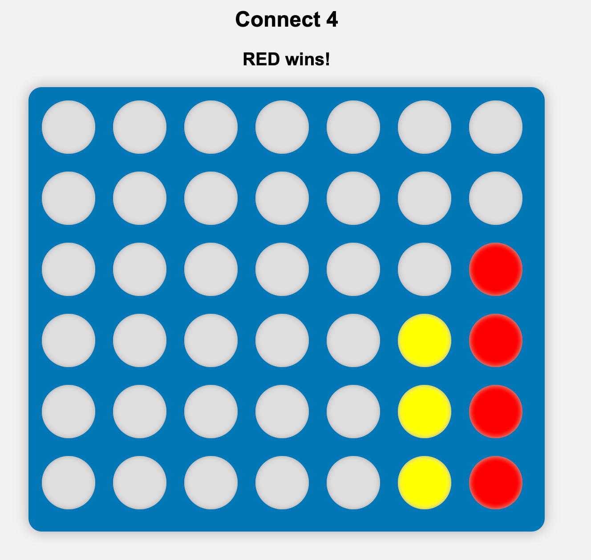

# Connect 4 Game

A simple browser-based Connect 4 game built with HTML, CSS, and JavaScript.
                       Authors : David & Salma 

## How to Play

- The game board has 7 columns and 6 rows.
- Players take turns clicking on a column to drop their colored disc (Red or Yellow).
- The disc will occupy the lowest available empty spot in that column.
- The first player to connect 4 discs vertically, horizontally, or diagonally wins the game.
- If the board fills up without any player winning, the game will end in a draw.

## Features

- Interactive grid built with JavaScript and styled with CSS.
- Real-time turn updates shown below the board.
- Automatic win/draw detection with on-screen messages.
- Responsive and simple UI.

## How to Run

1. Open the `index.html` file in any modern web browser.
2. Click on the columns to place your discs.
3. Play until a player wins or the game is a draw.

## Code Overview

- **HTML** sets up the basic page and board container.
- **CSS** styles the board, cells, and messages.
- **JavaScript** manages game logic, board state, player turns, and win conditions.

## Future Improvements

- Add a restart/reset button.
- Add animations for dropping discs.
- Improve mobile responsiveness.
- Add AI opponent for single-player mode.

---

Feel free to contribute or suggest improvements!

---

Created by DavidB & Salma